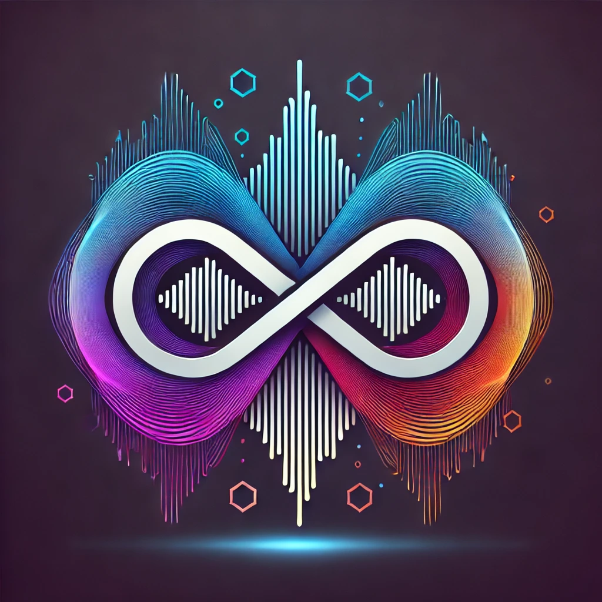

# `Voice-NFT`：AI驱动！收藏你的语音指纹

  

## 1 项目概述

### 1.1 项目背景

#### `NFT`技术

在过去几年中，`NFT（非同质化代币）`已成为数字资产领域的热门话题，特别是在艺术品、音乐、视频和虚拟物品等方面取得了巨大的进展。`NFT`通过区块链技术为数字资产提供了唯一标识，使得每件数字作品都能通过不可篡改的代币进行验证、交易和收藏。以`NFT`头像为例，`CryptoPunks`和`Bored Ape Yacht Club`这样的项目为每个用户提供了独一无二的数字形象，这些头像不仅是一种收藏品，也在社区互动中扮演了身份象征的角色。

尽管`NFT`在视觉艺术上取得了显著成功，但其在音频领域的应用仍在探索阶段。音频作为一种更具多维性、个性化的媒介，能否像视觉艺术那样拥有唯一性和稀缺性一直是一个挑战。如今，生成式`AI`技术的快速进步，尤其是在音频处理和分析方面的突破，开启了这一领域的新机遇。生成式`AI`不仅可以深入分析音频中的复杂特征，还能够从中提取出独特的指纹`（fingerprint）`。这一技术为音频`NFT`的唯一性认证带来了前所未有的可能性。

#### `ICP`区块链平台

`Internet Computer Protocol`，简称`ICP`，是由 `Dfinity`基金会开发的一个区块链项目。`ICP`旨在通过去中心化的方式构建一个全球范围内的去中心化互联网基础设施，让智能合约能够以`web`速度运行并进行大规模的数据存储，允许开发者在区块链上构建去中心化的应用程序`（dApps）`。

`ICP`与传统的区块链相比具有以下几个显著优势：**去中心化的计算能力、高效的扩展性、安全性和持久性以及低费用的交易**。这些优势使得`AI`生成的音频指纹及`NFT`能够以更低的成本和更高的效率进行存储和交易，在满足大量用户同时进行音频上传、处理和交易的需求的同时，确保了音频`NFT`在生成、存储和交易中的安全性与不可篡改性。

### 1.2 项目内容

通过将`AI`与`ICP`区块链平台相结合，我们的项目提出了一个全新的解决方案，旨在为每个用户的音频生成独特的`NFT`。此外，项目还支持用户上传多人语音音频，通过链上已有的音频`NFT`数据，系统能够自动识别并分辨出音频中的不同用户，进一步提升了音频`NFT`的交互性和实用性。这一过程不仅通过`AI`分析生成独一无二的音频指纹，还确保音频NFT在`ICP`区块链上安全存储并且不可篡改,为音频`NFT`带来了更多应用场景的同时，也拓展了`NFT`的边界，增加了用户之间的社交互动。

### 1.3 项目目标

我们项目的主要目标是通过`AI`技术为用户生成独特的音频`NFT`，并利用`ICP`区块链为这些NFT提供去中心化的安全存储和验证。具体而言，项目目标包括以下几方面：

>* **为音频`NFT`创建新形式**：通过`AI`生成独特的音频指纹，确保每个`NFT`都是独一无二的，并且代表了上传的音频文件和音频文件所代表的用户本身。
>* **提供透明且安全的交易环境**：利用`ICP`区块链的去中心化优势，保障用户上传的音频`NFT`在交易和存储过程中的安全性与透明性。
>* **增强音频`NFT`的交互性**：通过`AI`分析多人语音音频，项目能够自动识别出参与者并与链上已有的音频`NFT`匹配，提升用户之间的互动与合作机会。
>* **推动AI与区块链技术的融合**：通过结合生成式`AI`和区块链技术，为用户提供前所未有的音频`NFT`体验，展示`AI`如何为数字创意产业带来新的突破。

## 2 产品说明

### 2.1 产品功能概述

我们的`NFT`音频平台包含两个核心功能模块，分别是**音频`NFT`注册模块**和**复杂多人音频识别模块**，两者结合生成式`AI`技术与`ICP`区块链，确保用户能够创建独特的音频`NFT`，并基于该`NFT`进行丰富的社交交互。

#### 音频`NFT`注册与指纹生成模块

该模块负责将用户上传的音频文件转换为独特的音频`NFT`。它包括以下具体功能：

>* 音频文件上传与处理：用户可以通过平台上传音频文件，支持多种音频格式（如`MP3`、`WAV`等）。平台会将用户上传的音频文件传入`AI`模块进行后续生成。
>* 生成式`AI`音频分析：生成式`AI`对音频文件进行深入分析，提取音频中的多维特征，并根据分析结果，`AI`生成该音频的独特“指纹”`（Fingerprint）`，这是该音频的唯一标识，确保其与其他音频完全不同。
>* 音频NFT注册与上链：在生成音频指纹后，系统将音频指纹与元数据打包生成`NFT`，并将其上传至`ICP`区块链进行验证和存储。`ICP`区块链的去中心化特点保证了`NFT`不可篡改且永久存储，所有权信息公开透明。在购买服务后，用户可以在平台上查看已生成的`NFT`.

#### 复杂多人音频说话人识别模块

该模块支持分析包含多个说话者的音频，结合链上已有的`NFT`数据，自动识别并匹配说话人身份，提升音频`NFT`的互动性和多用户协作体验。主要功能包括：

>* 多人音频文件上传与解析：用户可以上传包含多个参与者的音频文件，如多人对话、会议录音等。系统对音频文件进行预处理后，会将音频文件传递到`AI`模块进行后续分析。
>* 说话人身份识别与匹配: 系统通过`AI`模型和链上已有音频`NFT`数据库，识别音频中的多个说话者，并尝试匹配与之对应的用户身份。
该功能支持为每个说话人生成独立的音频指纹，并关联已有的音频`NFT`，确保音频互动中的身份唯一性。

该模块支持用户进行多人协作项目，或在社区活动中识别和展示参与者的身份。

### 2.2 技术实现与支持

#### 整体技术架构

项目的技术架构由前端、后端、`AI`分析模块组成。其中，各模块的主要功能如下：

>* **前端**：为用户提供交互界面，并负责将音频分析请求以`http`请求的方式发送给`AI`分析模块进行分析；前端部分主要利用`Nodejs`、`React`、`CSS`以及`ICP`提供的交易、登录有关接口等进行撰写设计。
>* **后端**：负责数据处理和存储以及`icp`交易等相关的智能合约调用与账户维护；后端主要利用`Rust`、`ic`、`idk`以及`ICP`提供的相关开发工具进行编写设计。
>* **`AI`模块**：进行音频分析，为用户上传的个人语音生成独一无二的`fingerprint`以进行`NFT`铸币，或完成多人语音音频的用户识别任务。

#### 音频处理与`AI`技术

- pyannote/speaker-diarization-3.1：用于说话人分离（Speaker Diarization），它可以将音频中的不同说话人进行区分，并为每个说话人打上时间标记。它在多说话者场景（如会议录音或对话分析）中非常有用，帮助识别谁在什么时候发言。这对于构建语音指纹模型（如Voice NFT）的多用户音频处理至关重要。

- speechbrain/spkrec-ecapa-voxceleb：用于说话人识别（Speaker Recognition），基于ECAPA-TDNN架构，可以准确地从音频中提取说话人的身份特征（比如创建语音指纹）。这个模型常用于验证音频中是否存在特定的说话人，或将语音与已知的说话人数据库进行匹配，广泛应用于身份验证系统中。

- 本项目将AI模型服务化，为用户上传音频后不同的行为提供不同的服务。当用户选择铸造NFT时，服务会首先进行说话人分离，并且限制只能有一个说话人，并返回生成的语音指纹交由后端铸币；当用户选择说话人识别时，AI服务会区分说话人并返回所有人的语音指纹，后端再将每个语音指纹匹配上已有的NFT。

#### `ICP`区块链集成

本项目后端完全运行在ICP链上，本地测试由`dfx`提供支持。在ICP上运行了如下`canister`：

- Internet Identity: 用于前端重定向，对于未登录的用户需要进行身份认证后方可访问本服务。

- Ledger： 本Dapp的NFT铸币需要用户进行cycles支付才能进行，Ledger提供了转账的支持。

- Backend： 本Dapp的后端由rust编写，利用ic_cdk的支持实现了NFT数据上链的持久化存储和开放给其他`canister`的访问接口，可提供铸币等`update`访问和匹配说话人、列举自己注册的NFT等`query`访问。

- Frontend： 本Dapp的前端由node.js的React框架实现。该`canister`会把html，js等资源发送并在用户浏览器加载，以实现对本产品的访问支持

### 2.3 界面设计与交互体验

我们的平台设计注重用户体验，确保操作简洁易懂。用户可以在登录后，轻松上传音频并在支付服务后，申领得到`AI`分析生成后的音频文件对应的`NFT`，也能上传多人语音音频，获得`AI`识别的音频内说话人信息。简约的界面风格保证了用户的无障碍操作，即使是新手用户也能快速上手。

- 未登录界面：

- 登录后主页

- 上传铸币成功：

- 查询账户NFT

## 3 技术架构
本产品的技术架构图如下所示。

本产品基于`ICP`的`HTTP outcalls`机制，在`Web3`的`Dapp`中集成了`Web2`的`AI service`，使得互联网前沿的`AIGC`与`Web3`技术相结合，并为本产品赋能。产品中既包含了`Web3`的去中心化服务，不可篡改性存储，使得每个用户为自己铸造的`NFT`可以长期保证所有权，可定位账号与溯源；有结合了`Web2`中`AI`服务化的思想，解决了`ICP`中计算资源（例如`GPU`）不足的难点，可以利用`HTTP call `类似`Web2`请求一样访问到部署有语音识别与声纹提取模型的计算资源。以下详细介绍了每个服务的功能。

### 3.1 `Web3` 服务
本产品的`Web3`服务均部署在`ICP`上，可依赖于`dfx`在本地`linux`中测试运行

- `Internet Identity`： 用于用户前端账户认证。

- `Ledger`：用于使用本产品前用户的支付（例如：铸币需要提供`100_000_000 cycles`）。

- `Backend`: 本产品后端完全由`rust`编写，基于其严格的类型系统，产品中定义了`Voice-NFT`的铸币要求，并对用户的铸币记录进行了历史审查，条件合格者才有铸币机会。后端提供了以下接口：

    - `list_nfts`: 无参数，用于查询当前账户下拥有的NFT条目。
    - `count_all`: 无参数，用于统计当前产品中已有的NFT数量（不可查看细节）该接口仅供开发查询使用，并为其设置前端用户访问手段。
    - `register_voice_nft`: 参数为语音指纹与名称，同一个账户下允许有多个Voice-NFT,同一账户中不同NFT的名称字段不可重复。
    - `match_speakers`：参数为字符串到语音指纹的映射，用于区分复杂音频中的说话者，可返回用户参数中每个字符串对应已上链Voice-NFT的拥有者。
- `Frontend`：本产品前端由`NodeJS`的`React`框架编写，为用户提供了清晰易用的浏览器界面，并解决了 **`Chrome CSP` 禁止访问的难题**，分别为本产品提供了如下功能：

    - `login`：本产品中所有服务均需要认证后才可访问，用户可以通过前端的引导访问`Internet Identity`进行认证。
    - `generate_fingprint`： 用于音频上传后发送到AI服务器，利用了ICP `Canister`的`HTTP Agent`功能，对`Web2`服务进行访问，要求音频中只有一个说话人。
    - `upload`：（需要支付`cycles`）选择支付`ICP`金额后把生成的`fingerprint`上传至后端，由后端进行数据上链等铸币操作。
    - `analyze`：无需支付，把复杂音频的所有说话人信息发送至后端，由后端匹配已有`Voice-NFT`在音频中对应的说话人信息。

- `IDL`

    本产品用`Candid`作为前后端通信的接口语言，为不同的去中心化服务之间通信提供了统一标准
### 3.2 `Web2 AI`服务
本产品把AI模型进行了服务化，可以如同`Web2 App`一般向`service`发送请求，本产品的`AI`部分有如下架构：

-  `Speaker Diarization`： 用于区分说话人，根据上传的音频获得区分开来说话人的编号与音频中出现的时间。

- `spkrec-ecapa-voxceleb`：用于对每个单一说话人的音频，提取出嵌入的声音指纹（`voice fingerprint`）。

- `Manager`：上述模型均为`worker`服务。`Manager`用于接受用户请求，并对不同的用户请求流量进行转发，提供了对`Worker`的调度，使得在大请求流量下多个模型运行的计算资源可以得到充分的利用。实验表明，在4张`GPU`的情况下，目前的架构可以几乎完全利用计算资源而不会出现不同`GPU`占用差距很大的情况。

- **通信**：`Worker`和`Manager`之间采用`zmq`进行通信，本服务开通了2条`mq`，是保证调度均衡的关键。其中一条用于Worker就绪时发送`READY`信息，`Manager`每次收到用户请求时会到该处消费一条`READY`，并根据id在另一条管道中向空闲`Worker`发送需要执行的数据；`Worker`则会在拿到数据后开始运行，并在完成后向数据管道发回相应，同时生产一条`READY`。由此先完成任务的Worker可以更快的执行下一条指令，`Manager`每次通知也会发送到最可能空闲的Worker中而不引起阻塞。

## 4 市场分析和商业计划
### 4.1 市场分析

#### 4.1.1 项目概述
##### 4.1.1.1 项目背景
###### 行业环境
>* 随着`NFT`（非同质化代币）技术在数字艺术、音乐和虚拟物品领域取得显著成功，区块链技术为数字资产提供了唯一的标识和安全保障。然而，音频`NFT`的应用仍在探索中。音频作为一种更具个性化、多维度的媒介，其独特性和稀缺性仍然难以像视觉艺术那样得到广泛认可。
>* 由于生成式`AI`技术的快速进步，特别是在音频处理与分析方面的突破，音频`NFT`的唯一性和身份验证问题得到了全新解决。该项目利用`AI`生成独特的音频指纹，结合`Internet Computer Protocol (ICP)` 区块链技术，为用户提供一个安全、去中心化的音频`NFT`解决方案。

>* **NFT市场**：`NFT`（非同质化代币）已经在视觉艺术和数字收藏领域取得了巨大成功，预计到2025年，全球`NFT`市场将达到500亿美元。
>* **音频市场**：随着播客、音频书籍和音乐流媒体的普及，全球音频内容市场的需求也持续上升。音频内容的货币化和所有权保护将是未来的关键需求。
>* **技术趋势**：`AI`与区块链技术的结合正逐步推动数字内容的个性化和不可篡改性.

###### 目标市场
>* **主要受众**：音乐家、播客主持人、内容创作者、唱片公司、版权代理、语音识别与音频技术公司等。除此之外，广泛的音乐爱好者、播客听众、内容消费者、音频创作者、语音识别技术用户等也是潜在客户。
>* **市场需求**：音频创作者渴望通过`NFT`技术保障其作品的所有权，并希望通过去中心化的方式交易、分享或分发其内容。

###### 市场规模
>* **全球音频内容市场规模**：超过500亿美元（预计增长率为7.5%）。
>* **全球NFT市场**：未来三年内，`NFT`市场预计年增长率达30%以上，音频`NFT`的细分领域将是新的增长点。

###### 竞争分析
>* **竞争对手**：目前音频`NFT`市场的直接竞争者较少，但未来可能会面临视觉艺术`NFT`平台扩展至音频领域的竞争。但由于音频内容的独特性，音频`NFT`市场将具有更大的发展潜力。此外现已存在基于区块链的音频平台：如`Audius`，但该平台主要专注于音乐流媒体，而非音频`NFT`的注册与交易。

##### 4.1.1.2 核心技术
###### `AI`音频指纹生成
>* **生成式`AI`分析**：通过深度分析用户上传的音频文件，`AI`能够从中提取多维度的特征（例如音调、音频波形等），生成唯一的音频“指纹”（`Fingerprint`）。每个音频指纹都是独一无二的，确保每个`NFT`具有不可复制性和稀缺性。
>* **多用户语音识别**：`AI`不仅能够分析单一用户上传的音频，还能识别并区分多人的语音输入，提升音频内容的交互性与社交功能。
###### `ICP`区块链存储与验证
>* **区块链技术**：采用`ICP`区块链平台提供去中心化的计算能力、快速的数据处理和低成本的交易保障.`ICP`区块链能够以更高效、更安全的方式存储和验证音频`NFT`，确保其不可篡改、永久存在。
>* **去中心化优势**：与传统的区块链平台相比，`ICP`具备更好的扩展性和处理能力，允许大规模用户同时生成、上传和交易音频`NFT`，降低了交易成本，提高了用户体验。
###### 音频`NFT`的创新应用
>* **独特的数字资产**：`AI`生成的音频指纹赋予每个音频作品独特的价值，使其可以像传统`NFT`一样同时具有交易和收藏价值。
>* **社交互动功能**：通过音频`NFT`的多用户识别和匹配功能，用户可以参与社交互动，协作生成音频内容，并通过NFT市场进行交易。
##### 4.1.1.3 项目目标
>* 提供一个通过`AI`生成独特音频`NFT`的创新平台，并利用`ICP`区块链的去中心化存储和验证功能，确保音频内容在安全和透明的环境中流通。
>* 推动`AI`技术与区块链技术的融合，开创音频`NFT`的新应用场景，帮助创作者在数字世界中通过`NFT`形式保护和货币化其音频内容​​。

#### 4.1.2 `SWOT`分析
##### 4.1.2.1 优势(`Strengths`):
>* **技术领先**：通过结合`AI`和区块链技术，提供独特的`AI`生成音频`NFT`解决方案，满足用户对音频内容独特性和社交互动的需求。
>* **用户友好**：平台设计简洁直观，易于使用，让用户能够轻松上传、交易和分享音频`NFT`。
>* **社区互动**：通过多用户语音识别和协作功能，鼓励用户参与社交互动，增强平台社区氛围。
>* **安全高效**：`ICP`区块链提供的安全和高效存储与交易环境​

##### 4.1.2.2 劣势(`Weakness`):
>* **市场接受度**：音频`NFT`市场仍处于早期阶段，用户接受度可能较低，教育成本较高。
##### 4.1.2.3 机会(`Opportunities`):
>* **市场需求**：随着音频内容创作者和用户的增长，音频创作者对数字资产保护需求增加​，对独特、可交易和社交互动的音频`NFT`的需求将增加。
>* **技术进步**：`AI`和区块链技术的不断进步将推动平台的发展，提高其性能和用户体验。
##### 4.1.2.4 威胁(`Threats`):
>* **竞争**：随着更多平台进入音频`NFT`市场，竞争将加剧，需要不断创新和优化产品以保持竞争力。
>* **监管**：音频`NFT`市场可能面临监管挑战，需要遵守相关法律法规，确保平台合规运营。
### 4.2 商业计划
#### 4.2.1 执行摘要
本计划旨在推出全球首个基于`AI`和区块链技术的音频`NFT`平台，通过生成独特的音频指纹为创作者提供独一无二的数字资产。平台使用`Internet Computer Protocol (ICP)` 区块链为用户提供安全、去中心化的音频存储和交易服务，并通过`AI`识别多用户语音内容，支持协作和互动功能。计划目标是吸引音乐、播客、语音内容创作者等高价值用户群体，并在音频`NFT`领域中树立领先地位。
#### 4.2.2 产品策略
##### 4.2.2.1 核心功能 
>* **音频NFT生成**：通过AI分析用户上传的音频文件，生成独特的音频指纹，并铸造成`NFT`。
>* **多用户音频识别**：分析多人语音内容，识别并匹配音频中的参与者，支持复杂音频协作内容。
>* **`ICP`区块链存储和交易**：保证音频`NFT`的永久存储、安全性与透明交易。
##### 4.2.2.2 定价方案
>* **基础服务**：用户免费上传音频，支付小额铸造费即可获得`NFT`。
>* **高级服务**：多用户识别和互动服务需支付额外费用，或采用订阅模式，提出按月和按年的收费方案，同时针对企业用户提供定制化服务。
>* **交易费用**：平台将在每次`NFT`交易时收取2-5%的佣金，以支持平台运营和开发者激励。
##### 4.2.2.3 用户体验设计
>* **用户界面**：简洁直观的界面，方便用户上传、生成和交易音频`NFT`。
>* **互动功能**：提供社交互动功能，支持用户分享至第三方平台，如`X`、`Spotify`、`TikTok`等，支持用户评论和协作生成音频内容。
>* **多语言支持**：提供多语言界面，满足不同地区用户的需求。
##### 4.2.2.4 差异化策略
>* **`AI`技术优势**：利用先进的`AI`技术，提供独特的音频指纹和识别功能，为用户提供创新体验。为每个音频内容生成唯一指纹，确保其不可篡改。
>* **`ICP`区块链优势**：利用`ICP`区块链的去中心化存储和验证功能，确保音频`NFT`的安全性和透明性。
>* **社区建设**：通过社区活动、用户反馈和开发者激励，建立活跃的用户社区，推动平台的发展。
>* **多用户识别**：系统能够自动识别音频中的多名参与者，提高社交互动性，这在其他`NFT`平台上尚未实现。
>* **`ICP`区块链**：相较于传统区块链，使用`ICP`可以提供更高效的存储和交易能力，且成本更低。
#### 4.2.3 推广计划
##### 4.2.3.1 推广目标
>* **第一年用户目标**：吸引1万名音频创作者注册并使用平台，完成5万次`NFT`生成。
>* **未来三年目标**：成为全球领先的音频`NFT`平台，年增长率保持在50%以上。
##### 4.2.3.2 推广渠道
>* **社交媒体**：通过`Facebook`、`Instagram`、`TikTok`等社交平台进行广告投放，吸引音频创作者的关注。
>* **`KOL`合作**：与音乐、播客领域的意见领袖合作推广，邀请他们分享使用体验。
>* **合作伙伴关系**：与音乐制作公司、音频设备制造商、版权代理商合作，开展联合营销。
##### 4.2.3.3 用户获取策略
>* **首次铸造免费**：新用户首次注册平台时，提供一次免费铸造音频`NFT`的机会。
>* **推荐计划**：鼓励现有用户推荐新用户，成功推荐者将获得服务折扣或平台代币。

## 5 项目路线图

为了确保项目的有序推进和高效开发，我们制定了详细的技术路线图，涵盖了项目的各个阶段。从最初的概念设计到平台的最终发布，我们的路线图明确了每个阶段的关键里程碑和目标，并为每一项任务分配了合理的时间框架。通过路线图，我们可以清晰地展示如何将生成式`AI`与`ICP`区块链技术深度结合，最终实现一个功能全面、用户友好的`NFT`音频平台。

| 阶段                  | 时间框架   | 关键里程碑                                                                 | 目标                                                           |
|-----------------------|------------|---------------------------------------------------------------------------|----------------------------------------------------------------|
| 规划与概念阶段         | 第1周      | 确定`ICP`平台架构和功能模块设计、需求分析、技术选型，定义项目流程与团队分工 | 明确项目目标与核心功能，确定`ICP`技术架构，准备基础开发环境和工具 |
| 初期开发阶段           | 第2-3周    | 开发音频上传模块、`AI`音频分析功能、`NFT`注册与`ICP`区块链集成，测试基础功能     | 完成音频`NFT`注册模块及基础功能开发，确保与`ICP`区块链顺利集成，支持`NFT`存储与交易 |
| 多人音频识别模块开发   | 第4-5周    | 开发多人语音识别算法、链上数据匹配功能，实现多人音频`NFT`生成，确保模块整合顺畅 | 开发多人语音识别及`NFT`生成功能，确保多人互动性，完成链上匹配和`NFT`生成流程 |
| 内部测试与迭代         | 第6周      | 进行全面系统测试，修复`Bug`，优化`AI`分析效率和区块链交互性能，确保系统稳定性 | 优化并确保系统的性能与稳定性，修复关键问题，做好发布准备         |
| 公测与用户反馈         | 第7周      | 发布`beta`版，收集真实用户反馈，针对用户体验与功能进行优化，修正界面及交互设计 | 通过`beta`版测试改善用户体验，优化`AI`分析与区块链交互，提升系统响应速度 |
| 正式发布与市场推广     | 第8周及之后 | 正式发布并市场推广，扩展用户群体，推出社交互动功能，持续功能更新               | 支持大规模用户使用，推广到更广市场，持续优化平台                   |
